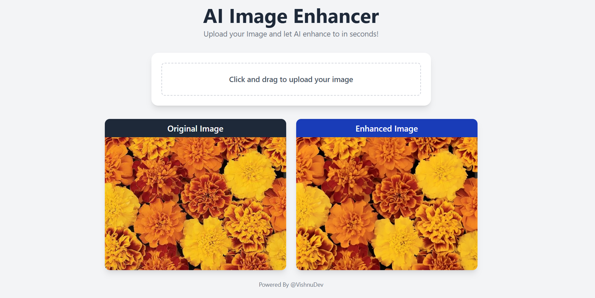

# 🖼️ AI Image Enhancer

A modern React-based web application that uses AI to enhance and improve the quality of images. Built with Vite for lightning-fast performance and modular code structure.

<!--   -->
---

## 🚀 Features

- 📷 Upload images from your device
- 🧠 Enhance images using AI algorithms
- 💾 Download the enhanced images
- ⚡️ Built with React + Vite for blazing-fast development
- 🎨 Clean, modern UI

---

## 🛠️ Tech Stack

- [React](https://reactjs.org/)
- [Vite](https://vitejs.dev/)
- [JavaScript](https://developer.mozilla.org/en-US/docs/Web/JavaScript)
- [Tailwind]()
<!-- - [Your AI API or Library Name here] -->

---

## 📦 Installation

```bash
# Clone the repository
git clone https://github.com/vishh2dev/Ai-image-enhancer.git
cd Ai-image-enhancer

# Install dependencies
npm install

# Start the development server
npm run dev
